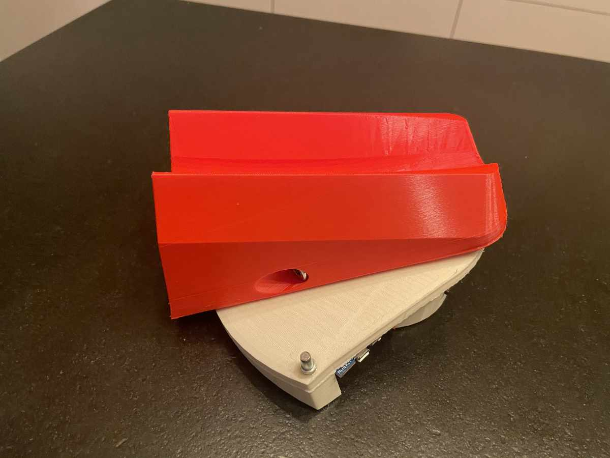

# ESP32ZwiftSteer

An ESP32 based, battery powered Zwift Steering Contoller.
Use an MH-ET LIVE MiniKit for ESP32 a Potentiometer and the 3D Printed parts from https://github.com/kwakeham/zwift-steerer/
(watch his Video for build instructions: https://www.youtube.com/watch?v=sgZ5960KFTI)

thx to petereverett for his work
https://sourceforge.net/projects/zwift-steering-esp32/

thx to Keith Wakeham for his 3D printed parts
https://github.com/kwakeham/zwift-steerer/
Modifications see Hardware Folder

## BOM
- [MH-ET LIVE MiniKit for ESP32](https://de.aliexpress.com/item/32814642296.html) x 1   
- [Potentiometer](https://www.adafruit.com/product/4646) x 1
- [power saving circuit](https://randomnerdtutorials.com/power-saving-latching-circuit/) x 1
- [3D Printed Parts -> https://github.com/kwakeham/zwift-steerer/](https://github.com/kwakeham/zwift-steerer/)
- [Batteriemanagment](https://de.aliexpress.com/item/32798858483.html) x 1 

## setup
nothing - autosetup -> just steer max left and max right on every start

- enable DEBUG (#define DEBUG)
- steer full left/full right -> note ADC value and enter the values next to #defines 
